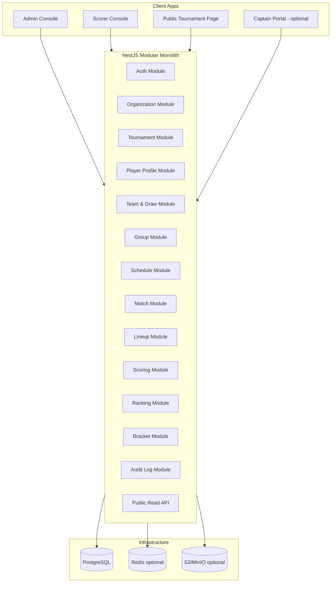
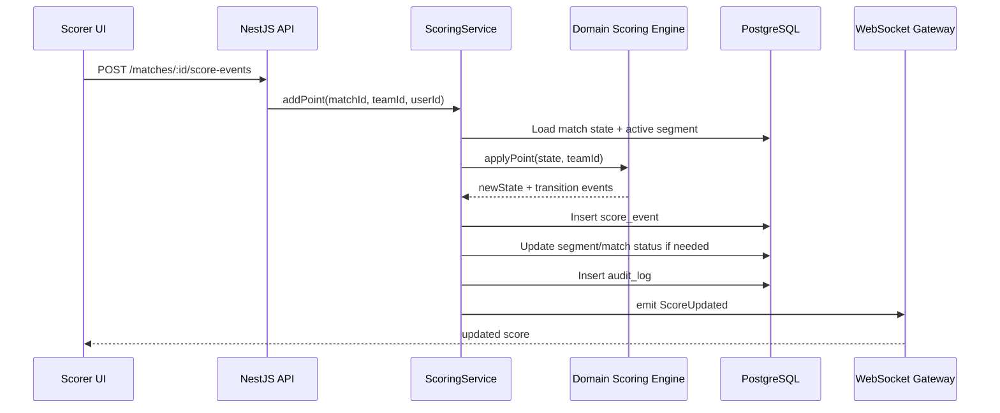

# 02 — System Architecture

## 1. Architecture style

Sử dụng **modular monolith**.

Lý do:

* MVP cần triển khai nhanh.
* Domain logic nhiều, nhưng traffic ban đầu chưa cần microservices.
* Dễ test, dễ debug, dễ cho AI code agent đọc.
* Sau này module nào lớn có thể tách service.
## 2. Recommended stack

|Layer|Technology|
|---|---|
|Frontend|Next.js, React, TypeScript, Tailwind, shadcn/ui|
|Backend|NestJS, TypeScript|
|Database|PostgreSQL|
|ORM|Prisma hoặc Drizzle|
|Realtime|WebSocket/Socket.IO|
|Cache|Redis, optional MVP|
|Queue|BullMQ, optional MVP|
|Storage|S3/MinIO, optional MVP|
|Auth|JWT access/refresh token hoặc session|

## 3. High-level architecture



## 4. Monorepo structure

```txt
golab-tournament-platform/
  apps/
    web/                         # Next.js app
    api/                         # NestJS API
    worker/                      # optional background jobs
  packages/
    domain/                      # pure business rules
    db/                          # schema, migrations, seed
    contracts/                   # shared DTO, Zod schemas, API types
    ui/                          # shared UI components
    config/                      # eslint, tsconfig, prettier
    test-utils/                  # test fixtures
  docs/
    README.md
    01_PRD.md
    02_SYSTEM_ARCHITECTURE.md
    ...
```

## 5. Backend module boundaries

### 5.1 AuthModule

Responsible for:

* Login/logout.
* JWT/session.
* Password hash.
* Current user.
* Permission guard.
Not responsible for:

* Tournament role semantics.
* Player profile logic.
### 5.2 OrganizationModule

Responsible for:

* Organization record.
* Organization members.
* Organization-level role assignment.
MVP has one organization: `GOLAB`.

### 5.3 TournamentModule

Responsible for:

* Tournament CRUD.
* Tournament status lifecycle.
* Tournament ruleset association.
* Public/private status.
### 5.4 PlayerProfileModule

Responsible for:

* Imported VĐV profiles.
* Unclaimed player data.
* Future claim support.
* Duplicate detection.
### 5.5 RegistrationModule

Responsible for:

* Linking player profile to tournament.
* Registration status.
* Import source.
MVP registrations are admin-imported and approved by default.

### 5.6 TeamModule

Responsible for:

* Team creation.
* Team members.
* Team random draw.
* Captain assignment.
### 5.7 GroupModule

Responsible for:

* Group A/B.
* Assign teams to groups.
* Validate group size.
### 5.8 ScheduleModule

Responsible for:

* Round-robin schedule generation.
* Match ordering.
* Court/time assignment.
### 5.9 MatchModule

Responsible for:

* Match metadata.
* Match teams.
* Match lifecycle.
* Match result.
### 5.10 LineupModule

Responsible for:

* Match segments.
* Segment order draw.
* Lineup submission.
* Lineup validation.
### 5.11 ScoringModule

Responsible for:

* Score event creation.
* Undo score event.
* Segment transition.
* Match completion.
* Live score broadcast.
### 5.12 RankingModule

Responsible for:

* Standings calculation.
* Tie-breakers.
* Ranking snapshots.
### 5.13 BracketModule

Responsible for:

* Knockout bracket generation.
* Advance winner.
* Award placement.
### 5.14 AuditLogModule

Responsible for:

* Append-only audit log.
* Reason for override.
* Before/after snapshot.
## 6. Domain package design

`packages/domain` should contain pure functions without database dependency.

```txt
packages/domain/
  team-draw/
    draw-teams.ts
    draw-teams.test.ts
  group/
    assign-groups.ts
  schedule/
    generate-round-robin.ts
  lineup/
    validate-lineup.ts
  scoring/
    apply-score-event.ts
    match-state-machine.ts
  ranking/
    calculate-standings.ts
  bracket/
    generate-golab-bracket.ts
```

Example:

```ts
export function validateLineup(input: ValidateLineupInput): ValidateLineupResult {
  // pure function only
}
```

The NestJS service should orchestrate:

1. Load data from DB.
2. Call domain function.
3. Persist result.
4. Emit event/audit.
## 7. Data flow example: add score point



## 8. Realtime approach

MVP:

* Use NestJS WebSocket gateway.
* Rooms:
    * `tournament:{tournamentId}`
    * `match:{matchId}`
Events:

```txt
score.updated
segment.completed
match.completed
standing.updated
bracket.updated
```

## 9. Deployment MVP

Recommended Docker Compose services:

```txt
web
api
postgres
redis optional
minio optional
```

Production path later:

```txt
VPS/Docker Compose -> managed Postgres -> managed Redis -> Kubernetes/containers -> CDN
```

## 10. Key architectural constraints

1. No direct DB writes from frontend.
2. No hard-coded tournament rules in controller.
3. Score changes must go through ScoringService.
4. Lineup must go through LineupValidationEngine.
5. Standings must be recalculated from match results, not manually edited except override with audit.
6. Public APIs must only expose published/safe data.
