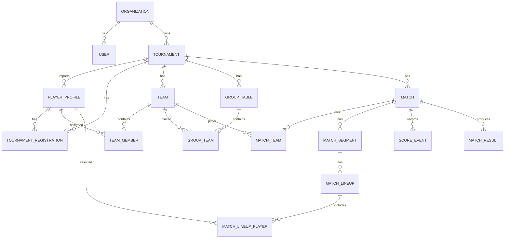
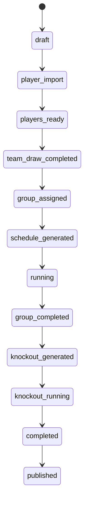
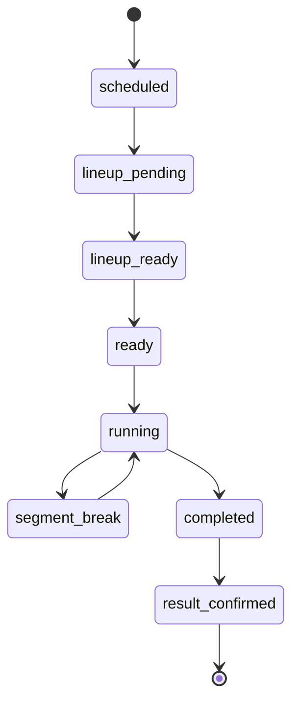

# 03 — Domain Model

## 1. Core domain idea

Hệ thống hiện tại vận hành một tournament đã có danh sách đăng ký. VĐV không cần tài khoản. Vì vậy domain phải phân biệt rõ:

* `User`: người đăng nhập app.
* `PlayerProfile`: hồ sơ VĐV, có thể chưa có tài khoản.
* `TournamentRegistration`: việc một VĐV tham gia một giải.
## 2. Main entities



## 3. Entity definitions

### 3.1 Organization

Represents a unit that owns tournaments.

MVP:

* One organization: GOLAB.
Future:

* Multiple clubs/companies can use SaaS.
Important fields:

* `id`
* `name`
* `slug`
* `status`
* `branding_config`
### 3.2 User

Represents login account.

MVP users:

* Admin.
* Scorer.
* Optional captain.
Players do not need user accounts initially.

### 3.3 PlayerProfile

Represents a VĐV/person.

MVP:

* Created by admin import.
* `user_id = null`.
* `claim_status = unclaimed`.
Future:

* Player creates account and claims profile.
* `user_id` links to `users.id`.
### 3.4 TournamentRegistration

Represents one player participating in one tournament.

MVP:

* Created automatically when admin imports players.
* Status usually `approved`.
* Source `admin_import`.
### 3.5 Tournament

Represents the Golab tournament.

Has:

* Basic info.
* Status lifecycle.
* Ruleset config.
* Stages, teams, matches.
### 3.6 Ruleset

Represents configurable rules for tournament.

For MVP, use Golab ruleset with:

* 8 teams.
* 3 male + 2 female per team.
* 2 groups.
* Relay match format 8/16/24.
* Ranking rules.
* Bracket mapping.
### 3.7 Team

Represents a tournament team.

MVP:

* Generated by team draw.
* Has 5 members.
* Optional captain.
### 3.8 GroupTable

Represents Bảng A or B.

Has 4 teams.

### 3.9 Match

Represents a match between two teams.

Can belong to:

* Group stage.
* Playoff.
* Semifinal.
* Final.
### 3.10 MatchSegment

Represents a segment/chặng in a relay match.

Example:

* Segment order 1, content `mixed_doubles`, target 8.
* Segment order 2, content `mens_doubles`, target 16.
* Segment order 3, content `womens_doubles`, target 24.
The order is drawn before match.

### 3.11 MatchLineup

Represents selected players for one team in one segment.

### 3.12 ScoreEvent

Represents one score change.

Important: source of truth for score timeline.

### 3.13 MatchResult

Represents final confirmed match result.

Created when match ends and confirmed.

## 4. Aggregate boundaries

### Tournament aggregate

Owns high-level setup:

* Tournament info.
* Ruleset.
* Status.
### Player registration aggregate

Owns:

* Player profile.
* Registration.
* Import/approval status.
### Team aggregate

Owns:

* Team.
* Team members.
* Captain.
### Match aggregate

Owns:

* Match teams.
* Match segments.
* Lineups.
* Score events.
* Match result.
Most important invariant: scoring must not mutate match illegally.

## 5. Status lifecycles

### 5.1 Tournament status



Recommended enum:

```txt
draft
player_import
players_ready
team_draw_completed
group_assigned
schedule_generated
running
group_completed
knockout_generated
knockout_running
completed
published
```

### 5.2 Match status



Recommended enum:

```txt
scheduled
lineup_pending
lineup_ready
ready
running
segment_break
completed
result_confirmed
cancelled
```

### 5.3 Segment status

```txt
pending
running
completed
skipped
```

### 5.4 Team draw status

```txt
preview
confirmed
cancelled
```

## 6. Domain invariants

### Player invariants

* Player full name must not be empty.
* Gender must be known for Golab rules.
* One player should not be registered twice in same tournament.
### Team invariants

* Team size = 5.
* Each team has 3 male and 2 female players.
* Player belongs to at most one team in same tournament.
### Group invariants

* Tournament has exactly 2 groups for Golab.
* Each group has exactly 4 teams.
* One team belongs to one group only.
### Match invariants

* Match has exactly 2 teams.
* Match cannot start without valid lineup.
* Match cannot receive score after completed.
* Only active segment can receive score.
* Segment 1 target = 8, segment 2 target = 16, segment 3 target = 24.
### Lineup invariants

* Each segment must have correct player count and gender.
* All 5 team members must play at least once in the match.
* Male player max segment count = 1.
* Male players must not be duplicated between mens doubles and mixed doubles.
### Scoring invariants

* Score never decreases except via undo event.
* Undo must mark previous event as undone or create compensating event.
* Segment ends immediately when one team reaches target.
* Match ends immediately when one team reaches 24.
* No win-by-two.
## 7. Domain events

Use domain events internally, even if MVP handles them synchronously.

```txt
TournamentCreated
PlayersImported
PlayersValidated
TeamDrawPreviewCreated
TeamDrawConfirmed
GroupsAssigned
ScheduleGenerated
LineupSubmitted
LineupValidated
MatchStarted
ScoreUpdated
SegmentCompleted
MatchCompleted
MatchResultConfirmed
StandingUpdated
BracketGenerated
BracketAdvanced
AwardsGenerated
```

## 8. Future extension points

* `PlayerProfile.user_id` enables account claiming.
* `TournamentRuleset.config` enables different tournament formats.
* `Organization` enables SaaS multi-tenant.
* `ScoreEvent` enables analytics and AI recap.
* `AuditLog` enables trust and dispute resolution.
