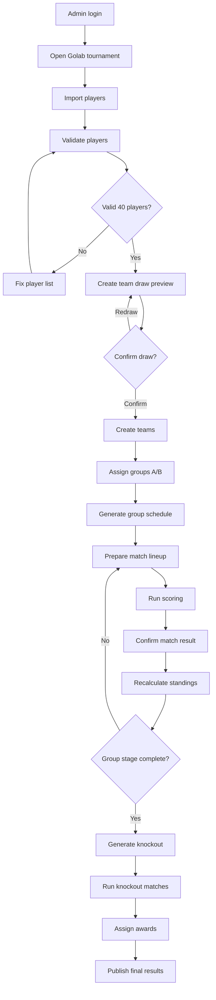

# 06 — Workflows

## 1. Full MVP workflow

## 2. Player import workflow

### Actor

Admin/BTC.

### Preconditions

* Tournament exists.
* Tournament status is `draft` or `player_import`.
* Admin has permission `PLAYER_IMPORT`.
### Steps

1. Admin opens Player page.
2. Admin uploads CSV/Excel or adds players manually.
3. System normalizes names.
4. System creates/updates `player_profiles`.
5. System creates `tournament_registrations` with status `approved`.
6. System validates counts.
7. System shows validation summary.
### Validation

* Full name required.
* Gender required.
* Total must be 40.
* Male must be 24.
* Female must be 16.
### Output

* 40 approved registrations.
* Tournament can move to `players_ready`.
### Audit actions

* `PLAYERS_IMPORTED`
* `PLAYER_CREATED`
* `PLAYER_UPDATED`
* `PLAYER_REMOVED_FROM_TOURNAMENT`
## 3. Team draw workflow

### Actor

Admin/BTC.

### Preconditions

* Tournament status = `players_ready`.
* 40 approved registrations.
* Player validation passes.
### Steps

1. Admin opens Team Draw page.
2. Admin clicks `Bốc thăm đội`.
3. System generates random seed.
4. System shuffles male/female separately.
5. System creates preview: 8 teams, each 3 male + 2 female.
6. System saves preview to `team_draws` status `preview`.
7. Admin can redraw or confirm.
8. On confirm:
    * System creates `teams`.
    * System creates `team_members`.
    * System updates draw status `confirmed`.
    * System updates tournament status `team_draw_completed`.
### Output

* 8 teams.
* 40 team members.
### Audit actions

* `TEAM_DRAW_PREVIEW_CREATED`
* `TEAM_DRAW_CONFIRMED`
* `TEAM_DRAW_CANCELLED`
## 4. Group assignment workflow

### Actor

Admin/BTC.

### Preconditions

* Team draw confirmed.
* 8 active teams.
### Steps

1. Admin opens Group Assignment page.
2. System creates Bảng A and B if not exists.
3. Admin chooses manual drag/drop or random assignment.
4. System validates each group has 4 teams.
5. Admin confirms.
6. System creates `group_teams`.
7. Tournament status becomes `group_assigned`.
### Output

* Bảng A has 4 teams.
* Bảng B has 4 teams.
### Audit actions

* `GROUP_ASSIGNMENT_PREVIEW_CREATED`
* `GROUP_ASSIGNMENT_CONFIRMED`
* `GROUP_ASSIGNMENT_UPDATED`
## 5. Schedule generation workflow

### Actor

Admin/BTC.

### Preconditions

* Groups assigned.
* Each group has exactly 4 teams.
### Steps

1. Admin opens Schedule page.
2. Admin clicks `Tạo lịch vòng bảng`.
3. System generates round-robin matches for each group.
4. Admin can edit scheduled time/court/order.
5. Admin publishes schedule.
6. Tournament status becomes `schedule_generated`.
### Output

* 12 group-stage matches.
### Audit actions

* `SCHEDULE_GENERATED`
* `MATCH_SCHEDULE_UPDATED`
* `SCHEDULE_PUBLISHED`
## 6. Match preparation workflow

### Actor

Admin/Scorer/Captain optional.

### Preconditions

* Match exists.
* Match status is `scheduled` or `lineup_pending`.
* Teams have 5 members.
### Steps

1. Admin/Scorer opens match detail.
2. System draws or admin inputs order of 3 contents.
3. System creates 3 `match_segments` with target scores based on order.
4. Admin/Scorer inputs lineup for Team A and Team B.
5. System validates both lineups.
6. If valid, lineups can be locked.
7. Match status becomes `ready`.
### Output

* 3 match segments.
* 6 match lineups: 2 teams x 3 segments.
* All lineups valid.
### Audit actions

* `MATCH_SEGMENT_ORDER_DRAWN`
* `LINEUP_SUBMITTED`
* `LINEUP_VALIDATED`
* `LINEUP_LOCKED`
## 7. Scoring workflow

### Actor

Scorer.

### Preconditions

* Match status = `ready`.
* Lineups locked and valid.
* User has `MATCH_SCORE_UPDATE` permission.
### Steps

1. Scorer starts match.
2. Segment 1 starts.
3. Scorer adds points to Team A/B.
4. System stores each point as score event.
5. When a team reaches 8, segment 1 completes.
6. System sets match status to `segment_break` for side switch.
7. Scorer starts segment 2.
8. When a team reaches 16, segment 2 completes.
9. Side switch.
10. Scorer starts segment 3.
11. When a team reaches 24, match completes.
12. Scorer/Admin confirms result.
13. System recalculates standings/bracket.
### Output

* Match result.
* Updated standings or bracket.
### Audit actions

* `MATCH_STARTED`
* `SCORE_EVENT_CREATED`
* `SCORE_EVENT_UNDONE`
* `SEGMENT_COMPLETED`
* `MATCH_COMPLETED`
* `MATCH_RESULT_CONFIRMED`
## 8. Group stage completion workflow

### Actor

Admin/BTC.

### Preconditions

* All 12 group matches result_confirmed.
### Steps

1. Admin opens Standings page.
2. System calculates standings.
3. System flags unresolved ties if any.
4. Admin resolves if needed.
5. Admin confirms group stage completion.
6. Tournament status becomes `group_completed`.
### Output

* Final ranking for Bảng A and B.
* Top 3 each group determined.
## 9. Knockout generation workflow

### Actor

Admin/BTC.

### Preconditions

* Group stage completed.
* A1/A2/A3/B1/B2/B3 determined.
### Steps

1. System generates bracket nodes:
    * P1: A2 vs B3.
    * P2: B2 vs A3.
    * SF1: A1 vs Winner P2.
    * SF2: B1 vs Winner P1.
    * Final: Winner SF1 vs Winner SF2.
2. System creates playoff matches P1 and P2.
3. As matches finish, winners advance.
4. Semifinal losers are assigned co-third place.
5. Final winner is champion, loser is runner-up.
### Output

* Complete bracket.
* Award assignments.
## 10. Public display workflow

Public page should be read-only and safe.

Display:

* Tournament info.
* Teams.
* Groups.
* Schedule.
* Live score.
* Standings.
* Bracket.
* Awards.
Public page should not expose:

* User emails.
* Internal notes.
* Audit log details.
* Admin-only override reasons unless explicitly published.
