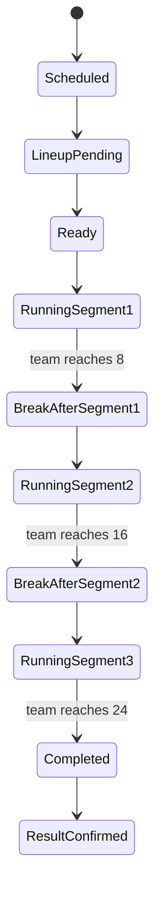

# 07 — Scoring Engine

## 1. Match format overview

Golab match format: **Đường đua Tiếp sức 24**.

A match has 3 segments. Points are continuous, not reset.

|Segment order|Target score|Meaning|
|---|---|---|
|1|8|Segment 1 ends when a team reaches 8|
|2|16|Segment 2 ends when a team reaches 16|
|3|24|Match ends when a team reaches 24|

No win-by-two.

## 2. Segment content vs target score

Content order is drawn before match.

Example:

```txt
Order 1: Đôi Nam Nữ -> target 8
Order 2: Đôi Nam -> target 16
Order 3: Đôi Nữ -> target 24
```

Target score depends on segment order, not content type.

## 3. State machine



## 4. Data source of truth

`score_events` is the source of truth for score timeline.

`matches.winner_team_id` and `match_results` are final snapshots after completion.

Never only update `matches.score_a` and `matches.score_b` without event log.

## 5. Score event structure

```ts
type ScoreEvent = {
  id: string;
  matchId: string;
  segmentId: string;
  scoringTeamId: string;
  eventNo: number;
  scoreAAfter: number;
  scoreBAfter: number;
  isUndone: boolean;
  createdBy: string;
  createdAt: string;
};
```

## 6. Current score calculation

Current score should be calculated from last non-undone score event.

If no score events:

```txt
Team A = 0
Team B = 0
```

Pseudo:

```ts
function getCurrentScore(events: ScoreEvent[]): Score {
  const validEvents = events.filter(e => !e.isUndone).sort(byEventNo);
  const last = validEvents.at(-1);
  if (!last) return { teamA: 0, teamB: 0 };
  return { teamA: last.scoreAAfter, teamB: last.scoreBAfter };
}
```

## 7. Add point algorithm

```ts
function addPoint(input: AddPointInput): AddPointResult {
  const { match, activeSegment, scoringTeamId, currentScore } = input;

  assert(match.status === 'running');
  assert(activeSegment.status === 'running');
  assert(scoringTeamId === match.teamAId || scoringTeamId === match.teamBId);

  const nextScore = {
    teamA: currentScore.teamA + (scoringTeamId === match.teamAId ? 1 : 0),
    teamB: currentScore.teamB + (scoringTeamId === match.teamBId ? 1 : 0)
  };

  const scoreEvent = createScoreEvent(nextScore);

  const transitions = [];

  if (nextScore.teamA >= activeSegment.targetScore || nextScore.teamB >= activeSegment.targetScore) {
    transitions.push({ type: 'SEGMENT_COMPLETED', segmentId: activeSegment.id });

    if (activeSegment.targetScore === match.winScore) {
      transitions.push({ type: 'MATCH_COMPLETED', winnerTeamId: scoringTeamId });
    } else {
      transitions.push({ type: 'SEGMENT_BREAK_REQUIRED' });
    }
  }

  return { scoreEvent, nextScore, transitions };
}
```

## 8. Segment transition rules

### Segment 1

* Starts at 0-0.
* Ends when either team reaches 8.
* Then side switch.
### Segment 2

* Starts with inherited score from segment 1.
* Ends when either team reaches 16.
* Then side switch.
### Segment 3

* Starts with inherited score from segment 2.
* Ends when either team reaches 24.
* Match completed immediately.
## 9. Undo point

Undo should be auditable.

Recommended MVP approach:

* Mark the target `score_events.is_undone = true`.
* Recompute current score from remaining non-undone events.
* If undone event caused segment/match completion, rollback segment/match state carefully.
Simpler MVP constraint:

* Allow undo only latest non-undone event.
* This makes rollback much safer.
Rule:

```txt
Can undo latest score event only if match result has not been confirmed.
```

Pseudo:

```ts
function undoLatestPoint(matchId, reason, userId) {
  const latest = getLatestNonUndoneScoreEvent(matchId);
  if (!latest) throw NO_SCORE_EVENT_TO_UNDO;

  if (match.status === 'result_confirmed') {
    throw MATCH_RESULT_ALREADY_CONFIRMED;
  }

  markUndone(latest, userId, reason);
  recomputeMatchState(matchId);
  audit('SCORE_EVENT_UNDONE');
}
```

## 10. Match completion

When one team reaches 24:

1. Insert final score event.
2. Mark active segment completed.
3. Set match status `completed`.
4. Set `matches.winner_team_id`.
5. Create or prepare `match_results`.
6. Broadcast `match.completed`.
Match result is not final until confirmed.

## 11. Result confirmation

Actor: Scorer or Admin.

Preconditions:

* Match status = `completed`.
* Winner exists.
* Final score exists.
On confirm:

* Set match status `result_confirmed`.
* Insert/update `match_results`.
* Emit `MatchResultConfirmed`.
* Recalculate standings if group match.
* Advance bracket if knockout match.
## 12. Error codes

|Code|Meaning|
|---|---|
|MATCH_NOT_RUNNING|Cannot add point because match is not running|
|NO_ACTIVE_SEGMENT|No active segment found|
|INVALID_SCORING_TEAM|Team is not part of match|
|SEGMENT_ALREADY_COMPLETED|Cannot score completed segment|
|MATCH_ALREADY_COMPLETED|Cannot score completed match|
|MATCH_RESULT_CONFIRMED|Cannot mutate confirmed match|
|NO_SCORE_EVENT_TO_UNDO|Nothing to undo|
|ONLY_LATEST_EVENT_CAN_BE_UNDONE|MVP only allows latest undo|
|LINEUP_NOT_READY|Match cannot start|

## 13. Realtime events

Emit events:

```txt
score.updated
segment.completed
segment.break_required
match.completed
match.result_confirmed
```

Payload example:

```json
{
  "matchId": "uuid",
  "teamA": { "id": "uuid", "score": 16 },
  "teamB": { "id": "uuid", "score": 12 },
  "activeSegment": {
    "order": 2,
    "name": "Đôi Nam",
    "targetScore": 16,
    "status": "completed"
  },
  "matchStatus": "segment_break"
}
```

## 14. Test cases

Must test:

1. Starts 0-0.
2. Team A reaches 8 -> segment 1 completed.
3. Score inherited into segment 2.
4. Team B reaches 16 -> segment 2 completed.
5. Team A reaches 24 -> match completed.
6. No win-by-two, 24-23 is valid final.
7. Cannot score after completed.
8. Undo latest point before confirmation.
9. Cannot undo after result confirmed.
10. Segment content order does not affect target scores.
