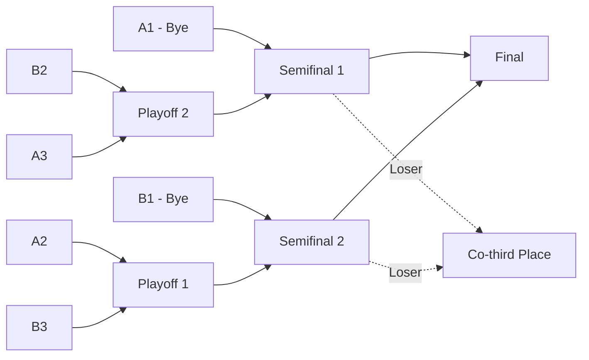

# 08 — Ranking and Bracket

## 1. Group stage

Golab has:

* 8 teams.
* 2 groups.
* 4 teams per group.
* Single round-robin.
Each group has 6 matches.

Total group stage matches = 12.

## 2. Round-robin generation for 4 teams

Given teams:

```txt
T1, T2, T3, T4
```

Generated rounds:

```txt
Round 1: T1 vs T4, T2 vs T3
Round 2: T1 vs T3, T4 vs T2
Round 3: T1 vs T2, T3 vs T4
```

Function:

```ts
generateRoundRobinSchedule(teams: Team[]): MatchPair[]
```

Requirements:

* Each pair plays exactly once.
* No team plays itself.
* For 4 teams, 6 pairs.
## 3. Standing fields

For each team in group:

```ts
type Standing = {
  teamId: string;
  matchesPlayed: number;
  wins: number;
  losses: number;
  pointsFor: number;
  pointsAgainst: number;
  pointDiff: number;
  rank: number | null;
  tieBreakDetail: Record<string, unknown>;
};
```

## 4. Ranking rules

Priority:

1. More wins.
2. Higher point difference.
3. Head-to-head.
Point difference:

```txt
points_for - points_against
```

## 5. Ranking algorithm

Pseudo:

```ts
function calculateStandings(groupTeams, confirmedMatches) {
  const rows = initializeRows(groupTeams);

  for (const match of confirmedMatches) {
    rows[match.teamA].matchesPlayed += 1;
    rows[match.teamB].matchesPlayed += 1;

    rows[match.teamA].pointsFor += match.teamAScore;
    rows[match.teamA].pointsAgainst += match.teamBScore;

    rows[match.teamB].pointsFor += match.teamBScore;
    rows[match.teamB].pointsAgainst += match.teamAScore;

    rows[match.winnerTeamId].wins += 1;
    rows[loserTeamId].losses += 1;
  }

  for (const row of rows) {
    row.pointDiff = row.pointsFor - row.pointsAgainst;
  }

  return sortWithTieBreakers(rows, confirmedMatches);
}
```

## 6. Tie-breaker handling

### 6.1 Simple two-team tie

If two teams tied on wins and point diff:

* Find match between the two teams.
* Winner ranks higher.
### 6.2 Multi-team tie

If 3+ teams tied after wins and point diff:

* Head-to-head may be ambiguous.
* System should not guess silently.
* Mark `requires_admin_decision = true`.
Possible future additional rules:

* Points for.
* Mini-table among tied teams.
* Drawing lots.
* Admin decision.
For MVP, if unresolved:

```json
{
  "requiresAdminDecision": true,
  "reason": "Tie remains after configured rules",
  "tiedTeamIds": ["...", "...", "..."]
}
```

## 7. Group qualification

After final standings:

* A1, A2, A3 qualify.
* B1, B2, B3 qualify.
* A4, B4 eliminated.
Qualification object:

```ts
type QualifiedSeeds = {
  A1: TeamId;
  A2: TeamId;
  A3: TeamId;
  B1: TeamId;
  B2: TeamId;
  B3: TeamId;
};
```

## 8. Knockout bracket structure



## 9. Bracket nodes

Recommended nodes:

|Node|Round|Team A source|Team B source|
|---|---|---|---|
|P1|playoff|A2|B3|
|P2|playoff|B2|A3|
|SF1|semifinal|A1|W:P2|
|SF2|semifinal|B1|W:P1|
|F|final|W:SF1|W:SF2|

## 10. Bracket generation algorithm

```ts
function generateGolabBracket(seeds: QualifiedSeeds): Bracket {
  return {
    nodes: [
      { key: 'P1', round: 'playoff', teamA: seeds.A2, teamB: seeds.B3, winnerTo: 'SF2' },
      { key: 'P2', round: 'playoff', teamA: seeds.B2, teamB: seeds.A3, winnerTo: 'SF1' },
      { key: 'SF1', round: 'semifinal', teamA: seeds.A1, teamBSource: 'W:P2', winnerTo: 'F', loserAward: 'third_place' },
      { key: 'SF2', round: 'semifinal', teamA: seeds.B1, teamBSource: 'W:P1', winnerTo: 'F', loserAward: 'third_place' },
      { key: 'F', round: 'final', teamASource: 'W:SF1', teamBSource: 'W:SF2' }
    ]
  };
}
```

## 11. Advance winner

When a knockout match result is confirmed:

1. Find bracket node for match.
2. Set node winner.
3. If node has `winnerTo`, fill target node slot.
4. If target node has both teams, create/update target match.
5. If node is semifinal, assign loser as co-third place.
6. If node is final:
    * Winner = champion.
    * Loser = runner-up.
## 12. Award assignment

Awards:

|Award|Recipient|
|---|---|
|Champion|Winner final|
|Runner-up|Loser final|
|Co-third|Loser SF1 and loser SF2|

For each award team, generate individual recipients for all 5 team members.

## 13. Error cases

|Error|Handling|
|---|---|
|Group stage incomplete|Cannot generate knockout|
|Unresolved tie|Require admin decision before bracket|
|Missing A1/A2/A3/B1/B2/B3|Cannot generate bracket|
|Match result changed after bracket advance|Require admin override + recalculation|

## 14. Tests

Must test:

1. 4-team group creates 6 matches.
2. Standings wins sorted correctly.
3. Point diff tie-break works.
4. Head-to-head tie-break works.
5. Unresolved 3-team tie flagged.
6. Top 3 each group selected.
7. A1/B1 get byes.
8. P1/P2 pairing correct.
9. Winners advance to correct semifinals.
10. Semifinal losers assigned co-third.
11. Final winner/loser assigned champion/runner-up.
