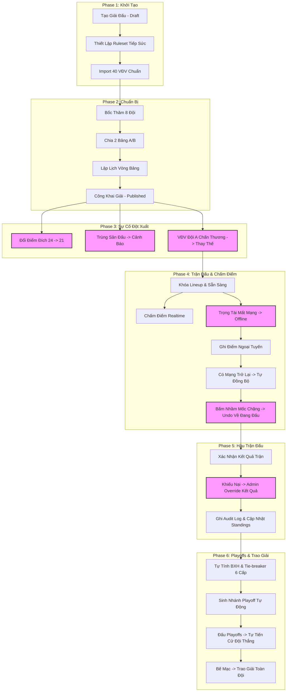

# 🏓 KỊCH BẢN KIỂM THỬ TOÀN DIỆN E2E (END-TO-END TESTING SCENARIO)
> **Dự án:** Hệ thống Quản lý Giải đấu Pickleball Đồng đội — GOLAB Tournament Platform
> **Mục tiêu:** Kiểm thử toàn bộ tính năng cốt lõi (Tạo giải -> Publish -> Xử lý sự cố đột xuất -> Trọng tài chấm điểm Offline/Realtime -> Đổi sân/Lịch -> Tie-breaker -> Playoffs Knockout -> Trao giải) đảm bảo tính chịu tải, tính bảo mật, và nghiệp vụ chính xác của MVP theo Clean Architecture + DDD Lite.

---

## 🏗️ Tổng Quan Luồng Kiểm Thử E2E

Sơ đồ dưới đây minh họa toàn bộ kịch bản kiểm thử E2E bao gồm cả các luồng xử lý sự cố khẩn cấp:



---

## 📅 PHẦN 1: KỊCH BẢN CHI TIẾT TỪNG BƯỚC (STEP-BY-STEP)

---

### 🟢 PHASE 1: TẠO GIẢI ĐẤU & THIẾT LẬP BAN ĐẦU (DRAFT STATE)

#### Bước 1.1: Tạo Giải Đấu Mới
* **Actor (Vai trò):** Ban tổ chức / Admin.
* **Thao tác UI:**
  1. Truy cập trang Quản trị `/admin` và bấm **"Tạo giải đấu mới"**.
  2. Nhập tên giải: `Cúp GOLAB Lần 2 — Đường đua Tiếp sức Đoàn kết`.
  3. Nhập Slug: `cup-golab-lan-2`.
  4. Bấm **"Lưu nháp"**.
* **Dữ liệu & Logic (API/DB State):**
  - Hệ thống tạo record trong bảng `tournaments` với trạng thái `DRAFT`.
  - Khởi tạo rỗng danh sách VĐV, Đội tuyển, Bảng đấu, Lịch thi đấu.
* **Kỳ vọng Hệ thống (Expected Behavior):**
  - Chuyển hướng sang trang Chi tiết giải đấu `/admin/[tournamentId]`.
  - Hiển thị card **"Việc cần làm tiếp theo"** thông báo: **"Thiết lập Luật thi đấu (Ruleset)"** ở trạng thái cho phép thực hiện (Allowed).

#### Bước 1.2: Cấu Hình Luật Thi Đấu Linh Hoạt (Ruleset Config)
* **Actor:** Admin.
* **Thao tác UI:**
  1. Truy cập tab **"Luật thi đấu"** của giải đấu.
  2. Cấu hình các chặng đấu:
     - Chặng 1: `Đôi Nam`
     - Chặng 2: `Đôi Nữ`
     - Chặng 3: `Đôi Nam Nữ`
  3. Thiết lập Điểm thắng đích (Target Score): `24 điểm` (mốc tích lũy chặng lần lượt là 8 -> 16 -> 24).
  4. Cấu hình **Cấm trùng chặng (Overlap Rules)**:
     - Thêm quy tắc: Cấm trùng VĐV Nam giữa `Chặng 1 (Đôi Nam)` và `Chặng 3 (Đôi Nam Nữ)`.
  5. Cấu hình **Yêu cầu ra sân**:
     - Bật tùy chọn `team.allPlayersMustPlay = true` (Bắt buộc tất cả thành viên trong đội đều phải ra sân thi đấu ít nhất 1 chặng).
  6. Bấm **"Lưu cấu hình Luật"**.
* **Dữ liệu & Logic:**
  - Cập nhật trường `ruleset` của giải đấu trong DB thành chuỗi JSON chứa toàn bộ cấu hình trên.
* **Kỳ vọng Hệ thống:**
  - Hiển thị Toast thông báo: *"Đã cập nhật cấu hình luật thi đấu thành công"*.
  - Tự động kiểm tra tính hợp lệ của luật (chỉ mục tăng dần, tổng điểm cuối bằng điểm đích, index chặng từ 0).

#### Bước 1.3: Import 40 VĐV Mẫu Chuẩn
* **Actor:** Admin.
* **Thao tác UI:**
  1. Truy cập tab **"Đấu thủ"** (Players).
  2. Bấm **"Import VĐV mẫu chuẩn"** (hoặc upload file CSV chứa danh sách 40 VĐV chuẩn của GOLAB).
  3. Hệ thống hiển thị bảng xem trước gồm: Họ tên, Giới tính (24 Nam, 16 Nữ), Hạng giống/Seed.
  4. Bấm **"Xác nhận Import"**.
* **Dữ liệu & Logic:**
  - Tạo 40 bản ghi trong bảng `player_profiles`.
  - Tạo 40 bản ghi trong bảng `tournament_registrations` liên kết với giải đấu, trạng thái `APPROVED`.
* **Kỳ vọng Hệ thống:**
  - Tầng Domain thực hiện chạy `LineupValidator` kiểm tra tỉ lệ giới tính.
  - Hiển thị badge: **"Đã xác thực danh sách VĐV: 40/40 VĐV (24 Nam, 16 Nữ) - Đạt chuẩn"**.
  - Ghi Audit Log hành động `PLAYERS_IMPORTED`.

---

### 🟡 PHASE 2: BỐC THĂM ĐỘI & LẬP LỊCH VÒNG BẢNG

#### Bước 2.1: Bốc Thăm Chia Đội Ngẫu Nhiên (Team Draw)
* **Actor:** Admin.
* **Thao tác UI:**
  1. Truy cập tab **"Đội tuyển"** (Teams) và bấm **"Bốc thăm đội"**.
  2. Hệ thống hiển thị giao diện bốc thăm. Bấm **"Chạy bốc thăm ngẫu nhiên"**.
  3. Hệ thống hiển thị danh sách **8 Đội tuyển** dưới dạng xem trước (Preview). Mỗi đội hiển thị đúng 5 VĐV (3 Nam + 2 Nữ).
  4. Bấm **"Xác nhận bốc thăm đội"**.
* **Dữ liệu & Logic:**
  - Gọi Domain Service `TeamDrawService` thực hiện trộn và phân phối VĐV nam/nữ biệt lập.
  - Khi xác nhận: Tạo 8 bản ghi trong bảng `teams` và 40 thành viên trong bảng `team_members`.
  - Ghi Audit Log hành động `TEAM_DRAW_CONFIRMED`.
* **Kỳ vọng Hệ thống:**
  - Đảm bảo tính Invariant của Domain: Không có VĐV nào xuất hiện ở 2 đội trở lên.
  - Card việc cần làm tiếp theo chuyển thành: **"Chia bảng đấu vòng bảng"**.

#### Bước 2.2: Chia Bảng Đấu (Group Assignment)
* **Actor:** Admin.
* **Thao tác UI:**
  1. Truy cập tab **"Bảng đấu"** (Groups).
  2. Hệ thống hiển thị hai bảng **Bảng A** và **Bảng B**.
  3. Bấm nút **"Tự động chia bảng"** (hoặc kéo thả thủ công).
  4. Đảm bảo mỗi bảng có đúng 4 đội tuyển.
  5. Bấm **"Lưu chia bảng"**.
* **Dữ liệu & Logic:**
  - Tạo các bản ghi liên kết đội tuyển vào bảng đấu tương ứng (`group_teams`).
* **Kỳ vọng Hệ thống:**
  - Hệ thống kiểm tra: Nếu tổng số đội khác 8 hoặc một bảng có số đội khác 4, nút lưu sẽ bị block.
  - Lưu thành công hiển thị Toast: *"Đã chia bảng đấu vòng bảng thành công"*.

#### Bước 2.3: Lập Lịch Thi Đấu Tự Động (Schedule Generation)
* **Actor:** Admin.
* **Thao tác UI:**
  1. Truy cập tab **"Lịch thi đấu"** (Schedule).
  2. Bấm **"Tạo lịch đấu tự động"**.
  3. Hệ thống tự động sinh ra **12 trận đấu vòng bảng** (mỗi bảng thi đấu vòng tròn 6 trận).
  4. Admin điều chỉnh thời gian và gán Sân thi đấu mặc định (ví dụ: Sân 1, Sân 2).
  5. Bấm **"Lưu lịch thi đấu"**.
* **Dữ liệu & Logic:**
  - Tạo 12 bản ghi trong bảng `matches` với trạng thái ban đầu là `SCHEDULED`.
* **Kỳ vọng Hệ thống:**
  - Hệ thống sinh lịch chuẩn xác theo thuật toán vòng tròn Round-Robin (mỗi cặp đội trong bảng gặp nhau đúng 1 lần).

#### Bước 2.4: Công Khai Giải Đấu (Publish Tournament)
* **Actor:** Admin.
* **Thao tác UI:**
  1. Quay lại Dashboard giải đấu.
  2. Ở khu vực **"Checklist công khai"** bên phải, hệ thống hiển thị: **"Đủ điều kiện công khai giải"** (tất cả các cấu hình luật, đội, bảng, lịch đều đã hoàn tất).
  3. Bấm nút **"Công khai giải"** (Publish).
* **Dữ liệu & Logic:**
  - Cập nhật trạng thái giải đấu (`tournaments.status`) thành `PUBLISHED`.
* **Kỳ vọng Hệ thống:**
  - Trình duyệt khách vãng lai khi vào trang Public `/t/cup-golab-lan-2` ngay lập tức xem được toàn bộ thông tin Đội hình, Lịch thi đấu vòng bảng và Bảng xếp hạng trống.

---

### 🚨 PHASE 3: SỰ CỐ ĐỘT XUẤT TRƯỚC GIỜ BÓNG LĂN (EMERGENCY CHANGES)

> [!WARNING]
> *Giai đoạn này mô phỏng các tình huống khẩn cấp thường gặp trong thực tế tổ chức giải đấu và kiểm tra khả năng tự phục hồi, tự xác thực của Rules Engine.*

#### Bước 3.1: Đổi Luật Thi Đấu Đột Xuất (Target Score 24 -> 21)
* **Tình huống:** Trước khi trận đấu đầu tiên khai mạc 10 phút, do điều kiện thời gian của sân đấu bị giới hạn, BTC quyết định đổi điểm đích từ 24 điểm xuống 21 điểm.
* **Actor:** Admin.
* **Thao tác UI:**
  1. Vào tab **"Luật thi đấu"**.
  2. Chỉnh sửa điểm thắng đích từ `24` thành `21`.
  3. Hệ thống tự động cập nhật mốc điểm chặng tích lũy của 3 chặng từ `8 - 16 - 24` thành `7 - 14 - 21`.
  4. Bấm **"Lưu thay đổi"**.
* **Dữ liệu & Logic:**
  - Hệ thống cập nhật cột `ruleset` trong bảng `tournaments`.
  - Domain Event hoặc Hook tự động quét các trận đấu chưa diễn ra để cập nhật lại cấu hình điểm số đích của các chặng đấu liên quan.
* **Kỳ vọng Hệ thống:**
  - Hiển thị Toast cảnh báo: *"Luật thi đấu đã thay đổi! Điểm đích mới của các trận đấu là 21 điểm (mốc chặng: 7 - 14 - 21)"*.

#### Bước 3.2: Thay Đổi Sân Đấu Đột Xuất -> Cảnh Báo Trùng Sân (Court Conflicts)
* **Tình huống:** Admin vô tình đổi lịch của **Trận 1 Bảng A** và **Trận 1 Bảng B** sang thi đấu cùng một **Sân số 1** vào cùng một khung giờ `17:00`.
* **Actor:** Admin.
* **Thao tác UI:**
  1. Vào tab **"Lịch thi đấu"**.
  2. Chọn Trận 1 Bảng A $\rightarrow$ Cập nhật thời gian: `17:00`, Sân: `Sân 1`.
  3. Chọn Trận 1 Bảng B $\rightarrow$ Cập nhật thời gian: `17:00`, Sân: `Sân 1`.
  4. Bấm **"Lưu thay đổi"**.
* **Dữ liệu & Logic:**
  - API nhận payload cập nhật trận đấu, kiểm tra sự trùng lặp bản ghi sân đấu & khung giờ.
* **Kỳ vọng Hệ thống:**
  - Trên màn hình lịch thi đấu xuất hiện **Banner cảnh báo đỏ (Conflict warning)**:  
    `⚠️ XUNG ĐỘT SÂN ĐẤU: Trận 1 Bảng A và Trận 1 Bảng B cùng sử dụng Sân 1 lúc 17:00!`
  - Admin phát hiện sai sót, chọn lại Trận 1 Bảng B sang `Sân 2` lúc `17:00` $\rightarrow$ Cảnh báo biến mất.

#### Bước 3.3: VĐV Đội A Gặp Chấn Thương -> Thay Thế Nhân Sự Đột Xuất
* **Tình huống:** Ngay trước khi trận ra quân diễn ra, VĐV nam `Nguyễn Văn A` của `Đội Xanh` bị chấn thương ngón tay, không thể thi đấu. Đội Xanh đã khóa lineup ra sân từ trước. BTC đồng ý cho Đội Xanh thay thế bằng VĐV ngoài danh sách là `Lê Hoàng B` (VĐV tự do).
* **Actor:** Admin.
* **Thao tác UI:**
  1. Vào tab **"Đội tuyển"** $\rightarrow$ chọn **"Đội Xanh"**.
  2. Tại danh sách thành viên, chọn `Nguyễn Văn A` $\rightarrow$ Bấm **"Thay thế VĐV"**.
  3. Nhập thông tin VĐV mới: Họ tên: `Lê Hoàng B`, Giới tính: `Nam`.
  4. Bấm **"Xác nhận thay thế"**.
* **Dữ liệu & Logic:**
  - Hệ thống cập nhật bảng `team_members`: Gỡ `Nguyễn Văn A`, thêm `Lê Hoàng B`.
  - Domain layer thực hiện: Kích hoạt giải phóng liên kết VĐV chấn thương khỏi các lineups đã đăng ký trước đó.
  - Tự động chuyển trạng thái lineup của các trận sắp tới liên quan tới Đội Xanh từ `LOCKED` về lại `DRAFT` (Mở khóa).
* **Kỳ vọng Hệ thống:**
  - Giao diện Admin hiển thị thông báo: *"VĐV Nguyễn Văn A đã được thay thế bởi Lê Hoàng B. Đội hình thi đấu liên quan đã tự động mở khóa để cấu hình lại."*
  - Ghi Audit Log hành động thay thế nhân sự khẩn cấp kèm ID VĐV.

---

### 🔵 PHASE 4: TRỌNG TÀI CHẤM ĐIỂM & ĐỒNG BỘ NGOẠI TUYẾN (SCORING)

#### Bước 4.1: Chuẩn Bị Trận Đấu & Đăng Ký Lineup Mới
* **Actor:** Trọng tài (Scorer).
* **Thao tác UI:**
  1. Vào trang chi tiết trận đấu `/admin/[tournamentId]/scoring` $\rightarrow$ chọn **Trận 1 Bảng A**.
  2. Thiết lập thứ tự chặng thi đấu: Chặng 1 Đôi Nam $\rightarrow$ Chặng 2 Đôi Nữ $\rightarrow$ Chặng 3 Đôi Nam Nữ.
  3. Trọng tài tiến hành nhập Lineup ra sân cho 2 đội (Đảm bảo VĐV nam mới thay thế `Lê Hoàng B` ra sân thi đấu đúng luật).
  4. Nhấp **"Khóa Đội Hình"** (Lock Lineup).
* **Dữ liệu & Logic:**
  - Kiểm tra các invariants của luật mới:
    - Lê Hoàng B (Nam) ra sân có vi phạm số chặng tối đa (max 2)?
    - Có vi phạm luật cấm trùng chặng giữa Chặng 1 (Đôi Nam) và Chặng 3 (Đôi Nam Nữ) hay không?
    - Đã cho tất cả 5 thành viên ra sân thi đấu tối thiểu 1 lần chưa?
  - Nếu tất cả hợp lệ, cập nhật trạng thái trận đấu thành `READY`.
* **Kỳ vọng Hệ thống:**
  - Nút **"Bắt đầu trận đấu"** chuyển sang trạng thái khả dụng. Giao diện bảng điểm hiển thị 0-0.

#### Bước 4.2: Bắt Đầu Trận Đấu & Ghi Điểm Realtime (Online Mode)
* **Actor:** Trọng tài.
* **Thao tác UI:**
  1. Bấm **"Bắt đầu trận đấu"**. Trạng thái trận đấu chuyển sang `ONGOING`.
  2. Bấm cộng điểm cho Đội Xanh (Team A) và Đội Hồng (Team B).
  3. Điểm số diễn ra: 1-0, 1-1, 2-1...
* **Dữ liệu & Logic:**
  - Mỗi lần bấm điểm, client phát một HTTP POST hoặc WebSocket event tới API.
  - Server ghi nhận bản ghi sự kiện điểm số vào bảng `score_events`.
  - Phát sự kiện WebSocket `match.score_updated` tới toàn hệ thống.
* **Kỳ vọng Hệ thống:**
  - Trang công khai của người xem tự động cập nhật điểm số theo thời gian thực (Realtime) dưới 100ms mà không cần tải lại trang.

#### Bước 4.3: Thiết Bị Mất Mạng Đột Ngột -> Ghi Điểm Ngoại Tuyến (Offline Mode)
* **Tình huống:** Khi tỉ số đang là `5-4` nghiêng về Đội Xanh ở Chặng 1, sóng wifi tại sân đấu bị mất kết nối hoàn toàn. Giao diện bảng điểm hiển thị cảnh báo đỏ **"Mất kết nối - Đang lưu ngoại tuyến"**.
* **Actor:** Trọng tài.
* **Thao tác UI:**
  1. Trọng tài tiếp tục quan sát và bấm cộng điểm trên giao diện:
     - Cộng Đội Xanh lên 6-4.
     - Cộng Đội Hồng lên 6-5.
     - Cộng Đội Xanh lên 7-5 (Đạt điểm chặng tích lũy của Chặng 1).
* **Dữ liệu & Logic:**
  - Do offline, API call thất bại. 
  - Frontend Scorer Console tự động bắt lỗi mạng và lưu trữ (push) các sự kiện điểm số này vào hàng đợi hàng đợi ngoại tuyến `Offline Queue` bên trong **LocalStorage** của trình duyệt.
  - Tự động hiển thị trạng thái chuyển chặng cục bộ trên thiết bị của trọng tài.
* **Kỳ vọng Hệ thống:**
  - Giao diện trọng tài không bị khóa cứng hay reload lỗi. Điểm số hiển thị đúng 7-5 ngoại tuyến.

#### Bước 4.4: Có Kết Nối Mạng Trở Lại -> Tự Động Đồng Bộ (Online Re-sync)
* **Tình huống:** Wifi sân đấu được khôi phục. Thiết bị của trọng tài tự động nhận lại tín hiệu internet.
* **Actor:** Hệ thống tự động.
* **Thao tác UI:**
  - Biểu tượng cảnh báo mất kết nối tự động chuyển thành màu xanh: **"Đã khôi phục kết nối - Đang đồng bộ..."** rồi chuyển sang **"Đã đồng bộ"**.
* **Dữ liệu & Logic:**
  - Trình duyệt kích hoạt sự kiện mạng `online`.
  - Frontend đọc hàng đợi từ `LocalStorage`, gửi gói payload chứa tất cả các log điểm offline lên API `/api/matches/:matchId/sync-offline-scores`.
  - Server replay lại các sự kiện theo đúng thứ tự timestamp, lưu vào DB và thông báo WebSocket.
* **Kỳ vọng Hệ thống:**
  - Trang công khai của khán giả ngay lập tức nhảy vọt từ điểm số `5-4` lên `7-5` và chuyển sang trạng thái Đổi chặng/Nghỉ chặng 1 chuẩn xác.

#### Bước 4.5: Lỗi Nhập Điểm -> Undo Điểm Biên Tại Mốc Đổi Chặng
* **Tình huống:** Ở Chặng 3 (Chặng quyết định đến mốc điểm đích 21). Điểm số tích lũy đang là Đội Xanh `20` - Đội Hồng `19`. 
  - Trọng tài bấm cộng 1 điểm cho Đội Xanh $\rightarrow$ Đội Xanh đạt `21` điểm.
  - Hệ thống tự động chuyển trạng thái trận đấu thành `WAITING_CONFIRMATION` (Chờ xác nhận) và đóng băng bảng điểm.
  - Tuy nhiên, trọng tài biên phát hiện bóng ngoài và trọng tài chính quyết định hủy điểm đó. Trọng tài chấm điểm cần **Undo** điểm thứ 21 này.
* **Actor:** Trọng tài.
* **Thao tác UI:**
  1. Trọng tài bấm nút **"Hoàn tác (Undo)"** trên màn hình Scorer.
* **Dữ liệu & Logic:**
  - Gửi request hoàn tác lên API.
  - Server tìm score event mới nhất, đánh dấu `is_undone: true`.
  - Domain layer chuyển trạng thái trận đấu ngược từ `WAITING_CONFIRMATION` quay lại `ONGOING`.
  - Điểm số Đội Xanh trả về `20` (Điểm số trận đấu khôi phục thành `20-19`).
* **Kỳ vọng Hệ thống:**
  - Giao diện bảng điểm mở băng, cho phép trọng tài tiếp tục ghi điểm.
  - Trang public cập nhật realtime điểm số về lại `20-19`.

---

### 🟣 PHASE 5: HOÀN THÀNH TRẬN ĐẤU & SỰ CỐ ĐOÀN BTC OVERRIDE

#### Bước 5.1: Hoàn Thành & Xác Nhận Kết Quả Trận Đấu
* **Actor:** Trọng tài.
* **Thao tác UI:**
  1. Tiếp tục trận đấu, Đội Hồng ghi điểm liên tiếp đạt `21` trước (Tỉ số chung cuộc: Đội Xanh `20` - Đội Hồng `21`).
  2. Trận đấu kết thúc. Trọng tài kiểm tra bảng điểm và bấm **"Xác nhận kết quả chung cuộc"**.
* **Dữ liệu & Logic:**
  - Cập nhật trạng thái trận đấu thành `CONFIRMED`.
  - Phát Domain Event `match.confirmed`. Standings Service bắt sự kiện và tự động tính toán lại BXH bảng A.
* **Kỳ vọng Hệ thống:**
  - Trận đấu khóa cứng, Scorer không thể cộng điểm hay can thiệp.
  - Bảng xếp hạng tạm thời cập nhật Đội Hồng được cộng 1 điểm thắng, Đội Xanh nhận 1 trận thua.

#### Bước 5.2: Kháng Nghị Đột Xuất -> Admin Override Kết Quả Ghi Audit Log
* **Tình huống:** 15 phút sau khi trận đấu xác nhận, Đội Xanh nộp đơn kháng nghị lên BTC vì trọng tài đếm thiếu 1 điểm tích lũy của họ ở Chặng 2. Sau khi xem lại băng hình kỹ thuật, Ban tổ chức chấp thuận kháng nghị và xác định kết quả thực tế phải là Đội Xanh thắng `21-20`. Trận đấu đã bị khóa nên chỉ Admin tối cao mới có quyền ghi đè (Override).
* **Actor:** Admin tối cao.
* **Thao tác UI:**
  1. Đăng nhập tài khoản Admin, vào trang chi tiết Trận 1 Bảng A.
  2. Bấm nút **"Ghi đè kết quả trận đấu"** (Admin Override).
  3. Hệ thống hiển thị modal. Nhập điểm số mới: Đội Xanh `21` - Đội Hồng `20`.
  4. Hệ thống bắt buộc nhập **Lý do ghi đè**: *"Chấp thuận kháng nghị kỹ thuật của Đội Xanh sau khi đối chiếu video Chặng 2"*.
  5. Bấm **"Xác nhận ghi đè"**.
* **Dữ liệu & Logic:**
  - Gọi API `/api/matches/:matchId/override-result` (yêu cầu quyền Admin tối cao).
  - Cập nhật lại kết quả trận đấu trong DB.
  - Tạo một bản ghi Audit Log thuộc bảng `audit_logs` lưu trữ: ID Admin, Hành động: `MATCH_RESULT_OVERRIDDEN`, Chi tiết: điểm cũ `20-21`, điểm mới `21-20`, Lý do: *"Chấp thuận kháng nghị..."*.
  - Phát Domain Event `match.confirmed` (for override) để kích hoạt Standings Service tính toán lại BXH.
* **Kỳ vọng Hệ thống:**
  - Kết quả trận đấu hiển thị nhãn màu vàng: **[Đã ghi đè kết quả]**.
  - Bảng xếp hạng tự động đảo ngược: Đội Xanh nhận 1 trận thắng, Đội Hồng nhận 1 trận thua.
  - Ghi nhận nhật ký kiểm toán (Audit log) bảo mật tuyệt đối không thể xóa sửa.

---

### 🏆 PHASE 6: PLAYOFFS KNOCKOUT & BẾ MẠC TRAO GIẢI

#### Bước 6.1: Phân Định Tie-Breaker 6 Cấp Độ Tự Động
* **Tình huống:** Kết thúc 12 trận vòng bảng. Tại Bảng A, Đội Xanh và Đội Vàng bằng điểm nhau (cùng có 2 trận thắng, 1 trận thua). Hệ thống cần tự động phân định thứ hạng để chọn đội vào thẳng Bán kết.
* **Actor:** Hệ thống tự động.
* **Kỳ vọng Hệ thống:**
  - Tầng Domain chạy bộ tính toán `StandingCalculator` áp dụng đúng tiêu chí tie-breaker theo thứ tự ưu tiên:
    1. Số trận thắng vòng bảng (Wins).
    2. Hiệu số điểm chênh lệch (Point Difference).
    3. Kết quả đối đầu trực tiếp giữa 2 đội (Head-to-Head).
  - Hệ thống tự động phân định Đội Xanh xếp vị trí **A1** (do thắng Đội Vàng ở trận đối đầu trực tiếp 21-20), Đội Vàng xếp vị trí **A2**.
  - Bảng xếp hạng hiển thị thứ hạng chính xác không có tranh chấp.

#### Bước 6.2: Khởi Tạo Vòng Playoffs Knockout Tự Động
* **Actor:** Admin.
* **Thao tác UI:**
  1. Vào tab **"Nhánh đấu Playoff"** (Bracket).
  2. Bấm nút **"Khởi tạo Playoff"**.
* **Dữ liệu & Logic:**
  - Kiểm tra điều kiện: Tất cả 12 trận vòng bảng đều phải ở trạng thái `CONFIRMED`.
  - Khởi tạo cây sơ đồ Playoffs (Bracket Tree) dạng Knockout:
    - **A1** (Đội Xanh) & **B1** được đặc cách thẳng vào Bán kết (Bye).
    - Trận Tứ kết 1 (Quarterfinal 1 - P1): **A2** (Đội Vàng) vs **B3**.
    - Trận Tứ kết 2 (Quarterfinal 2 - P2): **B2** vs **A3**.
* **Kỳ vọng Hệ thống:**
  - Nhánh đấu hiển thị trực quan sơ đồ dạng cây (Bracket Node). Các trận đấu Tứ kết tự động tạo ở trạng thái `SCHEDULED` với các cặp đội chính xác.

#### Bước 6.3: Tiến Cử Đội Thắng Tự Động Lên Nhánh Đấu
* **Tình huống:** Trận Tứ kết 1 giữa `Đội Vàng` và `Đội B3` diễn ra. Trọng tài chấm điểm và xác nhận kết quả: `Đội Vàng` thắng `21-15`.
* **Actor:** Trọng tài (chấm điểm) $\rightarrow$ Hệ thống (tự tiến cử).
* **Kỳ vọng Hệ thống:**
  - Ngay sau khi Trận Tứ kết 1 được xác nhận kết quả (`CONFIRMED`), hệ thống tự động đẩy **Đội Vàng** lên nhánh Bán kết 1 để đối đầu với hạt giống **B1** đang chờ sẵn.
  - Trên màn hình Public, nhánh đấu của người xem tự động cập nhật tên **Đội Vàng** vào ô trận Bán kết 1 tức thì.

#### Bước 6.4: Bế Mạc Giải Đấu & Trao Giải Toàn Đội
* **Tình huống:** Trận Chung kết diễn ra, Đội Xanh (A1) chiến thắng để lên ngôi vô địch. BTC bế mạc giải đấu.
* **Actor:** Admin.
* **Thao tác UI:**
  1. Bấm **"Kết thúc giải đấu"** (Complete Tournament) tại Dashboard.
* **Dữ liệu & Logic:**
  - Cập nhật trạng thái giải đấu thành `COMPLETED`.
  - Khóa toàn bộ các chỉnh sửa trên mọi trang quản trị.
  - Hệ thống tự động gán giải thưởng (`awards`):
    - **Vô địch (Champion):** Đội Xanh (Tự động gán huy chương cho toàn bộ 5 thành viên trong đội).
    - **Á quân (Runner-up):** Đội thua trận Chung kết.
    - **Đồng hạng ba (Co-third):** Hai đội thua ở Bán kết.
* **Kỳ vọng Hệ thống:**
  - Trang Public hiển thị bảng Vinh danh (Hall of Fame) rực rỡ với danh sách toàn bộ các đội và VĐV nhận giải kèm hiệu ứng confetti chúc mừng.

---

## 🧪 PHẦN 2: HƯỚNG DẪN BƯỚC THIẾT LẬP THỰC TẾ TRÊN MÁY CHỦ PRODUCTION

Để chạy thử nghiệm kịch bản E2E này trên môi trường thực tế **https://golabpick.armsss.online/**, anh có thể thực hiện theo các bước thiết lập nhanh sau đây:

### 1. Reset Cơ sở dữ liệu và nạp dữ liệu mẫu chuẩn (40 VĐV)
Anh SSH vào VPS Oracle và chạy lệnh seed dữ liệu chuẩn:
```bash
ssh -i ~/.ssh/oracle_affine opc@168.138.167.9
cd golab-tournament-pickleball
pnpm --filter @golab/db seed
```
> *Lưu ý: Lệnh seed này sẽ tự động tạo một tài khoản Admin mẫu, một giải đấu nháp và danh sách 40 VĐV chuẩn của BTC GOLAB gồm thông tin giới tính và hạt giống.*

### 2. Mô phỏng mất mạng (Offline Testing) trên trình duyệt
Để kiểm tra tính năng **Ghi điểm ngoại tuyến & Tự động đồng bộ (Phase 4.3 & 4.4)**:
1. Mở trang Scorer Console trên điện thoại hoặc máy tính.
2. Vào phần chấm điểm trận đấu, bấm **Bắt đầu**.
3. Bật chế độ máy bay (Airplane Mode) hoặc ngắt kết nối Wifi trên thiết bị chấm điểm.
4. Tiếp tục bấm cộng điểm $\rightarrow$ Kiểm tra xem giao diện có hiện cảnh báo **"Offline Mode"** màu đỏ và điểm số vẫn cộng bình thường hay không.
5. Bật lại Wifi/Mạng $\rightarrow$ Kiểm tra xem hệ thống có tự động gửi request đồng bộ và trang Public của người xem có tự nhảy điểm số lên hay không.

### 3. Kiểm tra Audit Log của Admin
Sau khi thực hiện hành động **Override kết quả (Phase 5.2)**, anh có thể kiểm tra xem nhật ký hệ thống đã ghi nhận đúng chưa bằng cách:
1. Vào mục **"Nhật ký hoạt động"** (Audit Logs) trên giao diện Admin: `/admin/[tournamentId]/audit`.
2. Kiểm tra dòng log có hành động `MATCH_RESULT_OVERRIDDEN`.
3. Xác nhận dòng log hiển thị chi tiết: Tên Admin, Điểm cũ, Điểm mới và Lý do ghi đè chính xác.

---
*Tài liệu này được lưu trữ vĩnh viễn tại [docs/17_E2E_TESTING_SCENARIO.md](file:///media/am/Data_D/AMWork/ai/golab-tournament-pickleball/docs/17_E2E_TESTING_SCENARIO.md) để hỗ trợ đội ngũ kiểm thử (QA/Tester) chạy tự động hoặc thủ công trước ngày khởi tranh giải đấu chính thức.*
